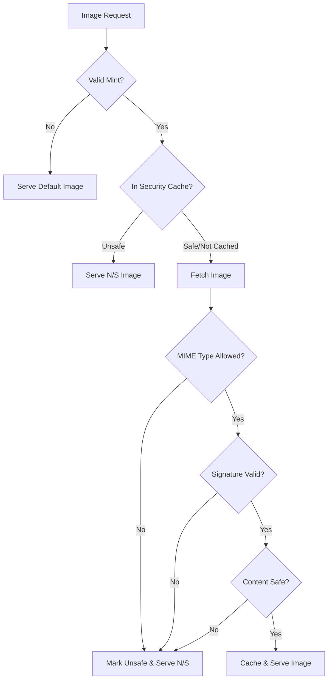

# Token Image Security Implementation

**File:** `docs/TOKEN_IMAGE_SECURITY.md`  
**Purpose:** Document security measures for token image handling  
**Last Updated:** 2025-09-21  

## 🔒 Security Overview

The token image service implements multiple layers of security to prevent malicious content from being served to users. This document outlines the security measures and best practices.

## 🛡️ Security Measures Implemented

### 1. MIME Type Whitelist
Only the following safe image formats are allowed:
- **JPEG** (`image/jpeg`) - Extensions: .jpg, .jpeg
- **PNG** (`image/png`) - Extension: .png
- **GIF** (`image/gif`) - Extension: .gif
- **WebP** (`image/webp`) - Extension: .webp
- **BMP** (`image/bmp`) - Extension: .bmp

**Explicitly Blocked:**
- **SVG** - Can contain JavaScript and other executable code
- **TIFF** - Can contain multiple pages and embedded data
- **ICO** - Can contain multiple images and potential exploits
- Any other non-whitelisted format

### 2. File Signature Validation (Magic Bytes)
Each file is validated against known file signatures to ensure:
- The file content matches the claimed MIME type
- Prevents MIME type spoofing attacks
- Detects disguised malicious files

**Signature Examples:**
```
JPEG: FF D8 FF (various subtypes)
PNG:  89 50 4E 47 0D 0A 1A 0A
GIF:  47 49 46 38 37/39 61 (GIF87a/GIF89a)
WebP: 52 49 46 46 ... 57 45 42 50 (RIFF...WEBP)
BMP:  42 4D (BM)
```

### 3. Content Scanning
Additional security checks include:
- **File size limit:** Maximum 10MB per image
- **XSS pattern detection:** Scans for `<script>`, `javascript:`, `onerror=`, etc.
- **Content validation:** Ensures image data is valid and not corrupted

### 4. Security Response Headers
The service adds security headers to responses:
- `X-Security-Status`: Indicates validation status
  - `validated` - Image passed all security checks
  - `blocked` - Image failed security checks
  - `blocked-unsafe-content` - Malicious content detected
  - `not-found` - Image not available

### 5. Security Caching
- Unsafe images are marked and cached to prevent repeated fetching
- Security status is stored separately from image data
- Validation is performed on cached content before serving

## 🚫 "Not Supported" (N/S) Image

When an image fails security validation, a special "N/S" image is served:
- Clear visual indicator that the image format is not supported
- Red warning color scheme
- Text clearly states "N/S" and "Not Supported"
- Served as safe SVG with no executable content

## 📊 Security Decision Flow



## 🔧 Implementation Details

### File Structure
- `token-image-secure.php` - Main secure image server
- `cache/token-images/*.img` - Cached image data
- `cache/token-images/*.cache` - Cache metadata
- `cache/token-images/*.security` - Security status records

### Security Logging
All security events are logged with appropriate severity:
```php
error_log("SECURITY: Blocked unsupported MIME type: $contentType");
error_log("SECURITY: File signature doesn't match claimed MIME type");
error_log("SECURITY: Suspicious content detected in image data");
```

## 🔄 Migration Path

### Phase 1: Parallel Deployment
1. Deploy `token-image-secure.php` alongside existing `token-image.php`
2. Test with subset of traffic
3. Monitor security logs for false positives

### Phase 2: Gradual Migration
1. Update frontend to use secure endpoint for new requests
2. Maintain backward compatibility
3. Monitor performance impact

### Phase 3: Full Migration
1. Redirect all traffic to secure endpoint
2. Deprecate original endpoint
3. Clean up legacy code

## ⚠️ Security Considerations

### Known Limitations
1. **GIF animations** - Allowed but limited to 10MB
2. **WebP** - Newer format, ensure browser compatibility
3. **BMP** - Large file sizes, consider converting to PNG

### False Positives
Some legitimate images may be blocked if:
- They have corrupted headers
- They exceed size limits
- They're served with incorrect MIME types

### Monitoring
Regular monitoring should include:
- Security log analysis
- N/S image serve rate
- Cache hit/miss ratios
- Performance metrics

## 🚀 Performance Impact

Security validation adds minimal overhead:
- **File signature check:** < 1ms
- **Content scanning:** < 5ms for typical images
- **Overall impact:** < 10ms per request

Caching mitigates performance impact:
- Validated images are cached for 60 days
- Security status is cached separately
- No re-validation needed for cached safe images

## 📝 Testing Checklist

- [ ] Test with valid JPEG images
- [ ] Test with valid PNG images
- [ ] Test with valid GIF images
- [ ] Test with valid WebP images
- [ ] Test with valid BMP images
- [ ] Test with SVG (should show N/S)
- [ ] Test with malformed images (should show N/S)
- [ ] Test with oversized images (should show N/S)
- [ ] Test with non-image files (should show N/S)
- [ ] Test with images containing script tags (should show N/S)

## 🔗 References

- [OWASP File Upload Security](https://owasp.org/www-community/vulnerabilities/Unrestricted_File_Upload)
- [Magic Bytes Database](https://www.garykessler.net/library/file_sigs.html)
- [Content Security Policy](https://developer.mozilla.org/en-US/docs/Web/HTTP/CSP)
- [Image Format Security](https://cheatsheetseries.owasp.org/cheatsheets/File_Upload_Cheat_Sheet.html)

---

**Note:** This security implementation follows industry best practices for handling user-generated content and untrusted image sources. Regular security audits and updates are recommended.
